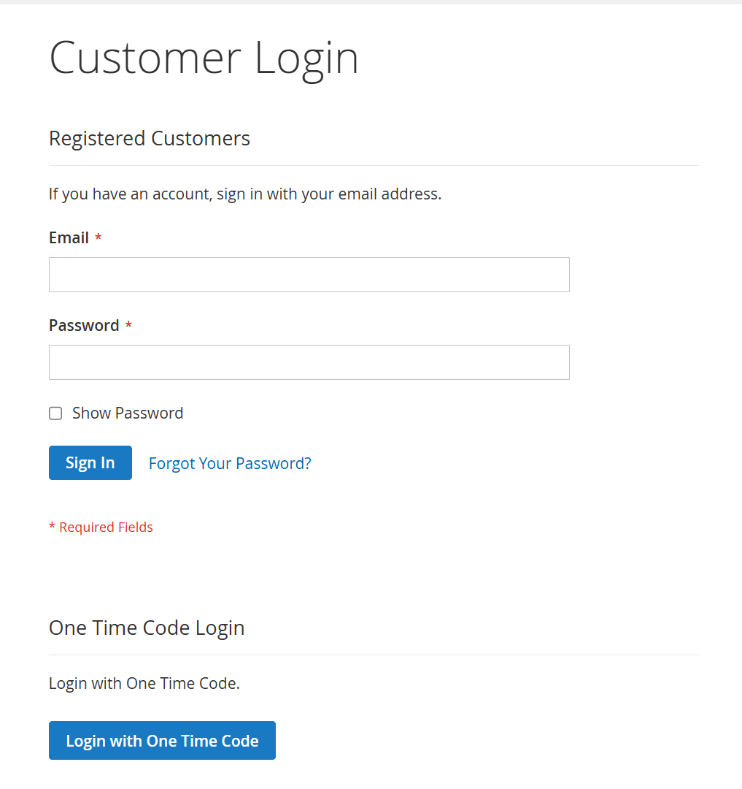
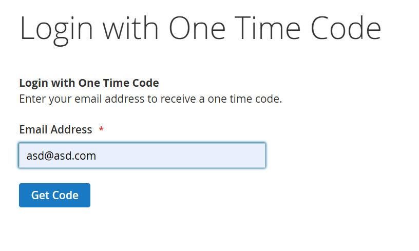
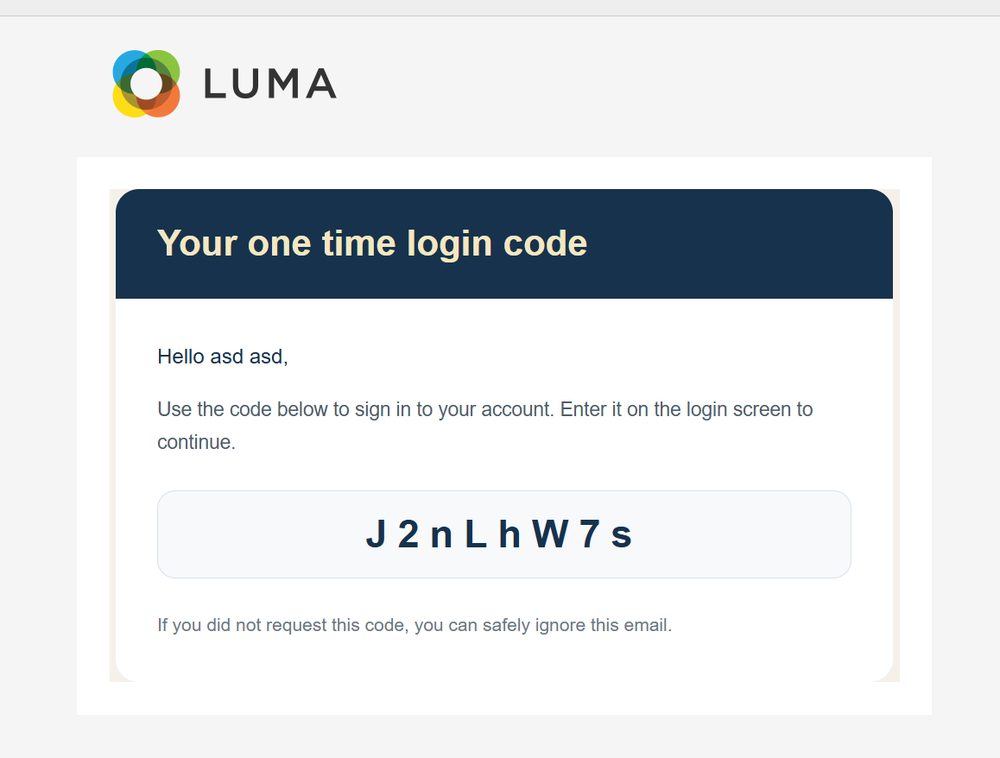
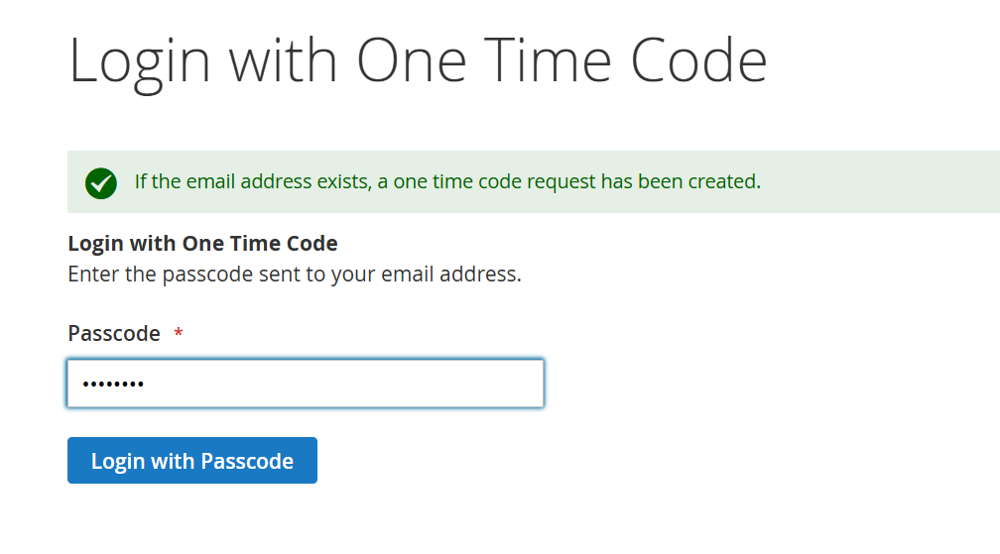

# HMH OTS Login

`Hmh_OtsLogin` adds one-time-code login to the Magento customer login flow.

The module provides:

- a storefront entry point on the customer login page
- an OTS login page where the customer requests a code by email
- GraphQL mutations to request and consume the code
- admin configuration for enablement, passcode validity, communication methods, and email sender
- repeat-request protection to avoid resending a code within five minutes

## Requirements

- PHP `>=8.1`
- Magento modules:
  - `magento/module-customer`
  - `magento/module-email`
  - `magento/module-graph-ql`
  - `magento/module-store`
- `hmh/magento2-hmh-core`

## Installation

Install the module in the Magento codebase, then run the standard Magento setup commands:

```bash
bin/magento module:enable Hmh_OtsLogin
bin/magento setup:upgrade
bin/magento cache:flush
```

If the project uses production compilation, run:

```bash
bin/magento setup:di:compile
```

## Configuration

Admin path:

`Stores > Configuration > HMH > OTS Login`

Available settings:

- `Enable`
- `Passcode Valid Period`
- `Communication Methods`
- `Email Sender`

The email content uses the transactional template declared in `etc/email_templates.xml` and shipped by the module at `view/frontend/email/ots_code.html`.

## Storefront Flow

1. The customer opens the standard login page.
2. The module adds a `One Time Code Login` entry point.
3. The customer submits their email address.
4. The module creates an OTS request and sends the code by email.
5. If a request already exists for the same customer within the last five minutes, no new code is sent and the user is told to wait.
6. The customer submits the code and is logged in.

## Screenshots

### Customer Login Entry



### Request Code Form



### Email With Code



### Login With Code


